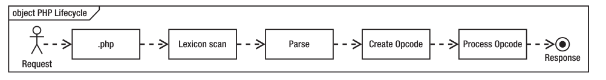

# 理解PHP原理之Opcode

​	文章内容来源于：

​	https://blog.linuxeye.cn/361.html

​	[风雪之隅的博客](http://www.laruence.com/2008/06/18/221.html)

## 什么是Opcode

​	当解释器完成对脚本代码的分析后，便将它们生成可以直接运行的中间代码，也称为操作码（Operate Code，opcode）。

​	**详情请查看鸟哥[博客](http://www.laruence.com/2008/06/18/221.html)**

## 使用Opcode缓存

​	这得从PHP代码的生命周期说起，请求PHP脚本时，会经过五个步骤，如下图所示：

​	Zend引擎必须从文件系统读取文件、扫描其词典和表达式、解析文件、创建要执行的计算机代码（称为Opcode），最后执行Opcode。每一次请求PHP脚本都会执行一遍以上步骤，如果PHP源代码没有变化，那么Opcode也不会变化，显然没有必要每次都重行生成Opcode，结合在Web中无所不在的缓存机制，我们可以把Opcode缓存下来，以后直接访问缓存的Opcode岂不是更快，启用Opcode缓存之后的流程图如下所示：

	

​	

​	Opcode cache的目地是避免重复编译，减少CPU和内存开销。如果动态内容的性能瓶颈不在于CPU和内存，而在于I/O操作，比如数据库查询带来的磁盘I/O开销，那么opcode cache的性能提升是非常有限的。

## 常用Opcode缓存

### apc

### opcache

